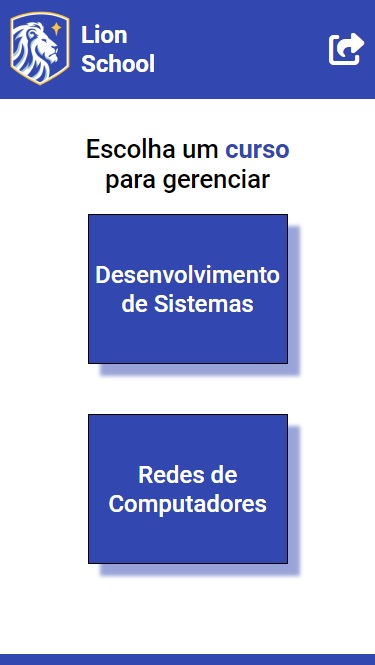
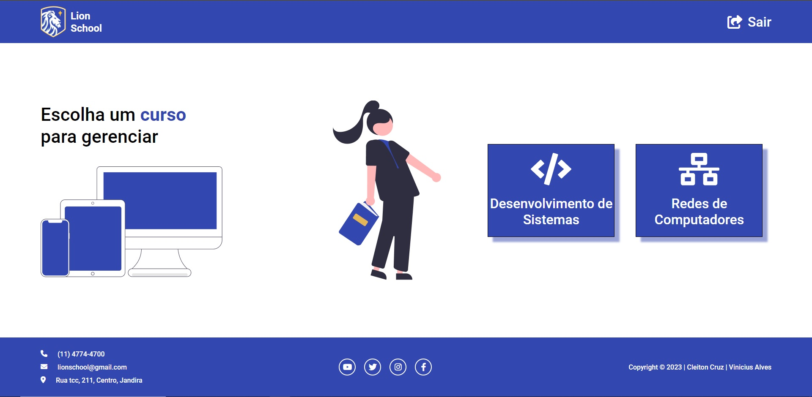

# LION SCHOOL

| MOBILE                                     |             DESKTOP             |
| :----------------------------------------- | :-----------------------------: |
|  |  |

## [Clique aqui](https://lion-school-cleiton.netlify.app/html/) para acessar o site

   
<h1>SUMÁRIO</h1>

- [TO DO LIST](#to-do-list)
- [TECNOLOGIAS APLICADAS](#tecnologias-aplicadas)
- [FERRAMENTAS](#ferramentas)
- [CONCEITOS APLICADOS](#conceitos-aplicados)
- [DOCUMENTACAO](#documentacao)
- [COLABORADORES](#colaboradores)

   <h1>SOBRE</h1>

Esse projeto foi proposto pelo professor de PWFE (Programação Web Front End) em conjunto com a disciplina de PWBE (Programação Web Back End) com intuito de desenvolvermos um website da escola ficticia LION SCHOOL onde poderíamos consultar dois cursos Desenvolvimento e Redes, onde teríamos os alunos, matérias e suas respectivas médias.

   <h1>TO DO LIST:</h1>   

- Desenvolver o site Lion School
- Criar parte das telas dinamicamente
- Design no [Figma](https://www.figma.com/file/oTFvqdytV3OGj2MXVSSfCl/Lion-School?node-id=0%3A1&t=73Dmayd1vaHrwQXD-1) 
- Tornar responsivo

   <h1>TECNOLOGIAS APLICADAS</h1>

- HTML5
- CSS3
- JAVASCRIPT
- nodeJS

<h1>FERRAMENTAS</h1> 
       
    
<h1>CONCEITOS APLICADOS</h1>   

- JSON
- API
- LOCAL STORAGE
- ASYNC & AWAIT

<h1>DOCUMENTAÇÃO</h1> 

- A documentação da API foi gerada de forma padrão pelo postman [clique aqui](https://documenter.getpostman.com/view/23640178/2s93Xwy42q) para conferir.

   <h1>COLABORADORES</h1>

| NOMES                                                                                                                                                                                      |                                                     GITHUB                                                      |                                       FOTO                                       |
| :----------------------------------------------------------------------------------------------------------------------------------------------------------------------------------------- | :-------------------------------------------------------------------------------------------------------------: | :------------------------------------------------------------------------------: |
|  |  | </a> |
|       |  | </a> |
